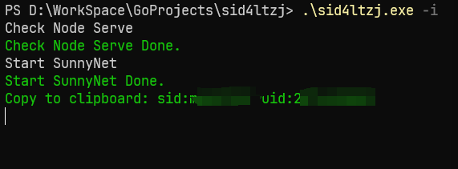

# 请查看：[https://github.com/LauZzL/leitingzhanji-jshookserver](https://github.com/LauZzL/leitingzhanji-jshookserver)

支持 `^Windows 7`、`Linux`、`^MacOS 10.x`

#### 该仓库仅用于学习交流，请勿用于非法用途、商用
#### 该仓库仅用于学习交流，请勿用于非法用途、商用
#### 该仓库仅用于学习交流，请勿用于非法用途、商用

### 如何使用

> 退出后需要执行命令 `sid4ltzj -q` 取消代理，否则可能引起网络连接错误

需要配合Node服务使用 [here](https://github.com/LauZzL/leitingzhanji)

#### Golang

1. 克隆本仓库
2. 安装库 `go mod tidy`
3. 运行 `go run main.go -i`
4. 启动游戏

#### Release

1. 下载 [sid4ltzj](https://github.com/LauZzL/sid4ltzj/releases)
2. 输入命令 `./sid4ltzj.exe -i`
3. 启动游戏

